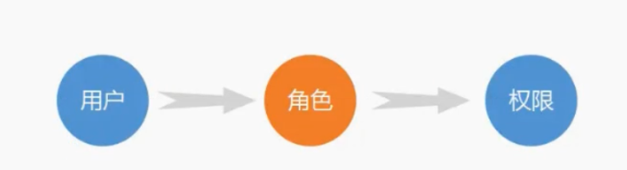

# sxp-server

sxp-server是一个精简的后台业务系统，内置一些简化版的上线功能，抽象出一些比较通用的方法。
某些代码和功能由于简化了，可能需要进行一些合理性的扩展，但思路是大体上不变的，本项目会持续进行优化。

# 项目介绍

底层设计是基于gin框架实现的，自己封装了一些功能：
- gorm操作mysql
- redis缓存与分布式锁
- zaplog记录日志，
- jaeger链路追踪，
- jwt的token认证，
- casbin权限管理，
- grpc调用和拦截器的使用，
- kafak生产者和消费者，
- 基于redis实现的分布式定时任务队列（timingWheel），
- RBAC模型的权限分配，
- 令牌桶限流和滑动窗口限流
- 高并发场景下的红包功能设计等。

sxp-server的功能比较繁杂，不会一一进行介绍，下面选择了一些记录一下

# RBAC基于角色的权限控制模型

在权限管理这一块，RBAC模型是一种通用的解决方案，大部分公司都是围着这个模型进行的权限功能设计，
核心思想是围绕着user-role-permission这个概念，结合自己的业务进行权限管理相关功能实现。

sxp-server也基于RBAC模型设计了一个权限管理方案，表结构的设计如下所示：

sxp-server后台系统的权限管理，参考了我在实际项目中遇到的一些场景。在RBAC0模型的基础上，加入了部
门（dept）的概念，users属于depts，depts关联roles，roles关联menus即可实现users和menus的
关联，user通过部门进行权限的分配。当然这种设计是根据业务的不同进行调整的，比较简单的场景中，甚至都
不需要roles这一层。线上项目中比较复杂的一些约束条件在本项目中没有实现，这里只提供一下设计的思路。

# casbin

本项目中主要用于访问控制策略
- 定义策略：
    [Request定义]
    r = sub, obj, act
    
    [策略定义]
    p = sub, obj, act
    
    [policy_effect]
    e = some(where (p.eft == allow))
    
    [匹配器定义]
    m = r.sub == p.sub && (keyMatch2(r.obj, p.obj) || keyMatch(r.obj, p.obj)) && (r.act == p.act || p.act == "*")

- 代码初始化
  
  m, err := model.NewModelFromString(text)
 
  e, err := casbin.NewSyncedEnforcer(m, Apter)
 
  [从db加载策略]
  err = e.LoadPolicy()

- 在中间件中使用
  res, err := e.Enforce(claims.Username, path, method)
    
