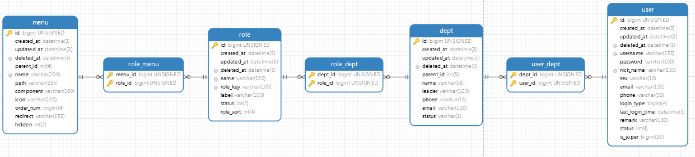

# sxp-server

sxp-server是一个精简的后台业务系统，内置一些简化版的上线功能，抽象出一些比较通用的方法。
某些代码和功能由于简化了，可能需要进行一些合理性的扩展，但思路是大体上不变的，本项目会持续进行优化。


# 项目介绍

底层设计是基于gin框架实现的，自己封装了一些功能：
- gorm操作mysql
- redis缓存与分布式锁
- zaplog记录日志，
- jaeger链路追踪，
- jwt的token认证，
- casbin权限管理，
- grpc调用和拦截器的使用，
- kafak生产者和消费者，
- 基于redis实现的分布式定时任务队列（timingWheel），
- RBAC模型的权限分配，
- 令牌桶限流和滑动窗口限流
- 高并发场景下的红包功能设计等。

sxp-server的功能比较繁杂，不会一一进行介绍，下面选择了一些记录一下


# RBAC基于角色的权限控制模型

在权限管理这一块，RBAC模型是一种通用的解决方案，大部分公司都是围着这个模型进行的权限功能设计，
核心思想是围绕着user-role-permission这个概念，结合自己的业务进行权限管理相关功能实现。


sxp-server也基于RBAC模型设计了一个权限管理方案，表结构的设计如下所示：



sxp-server后台系统的权限管理，参考了我在实际项目中遇到的一些场景。在RBAC0模型的基础上，加入了部
门（dept）的概念，users属于depts，depts关联roles，roles关联menus即可实现users和menus的
关联，user通过部门进行权限的分配。当然这种设计是根据业务的不同进行调整的，比较简单的场景中，甚至都
不需要roles这一层。线上项目中比较复杂的一些约束条件在本项目中没有实现，这里只提供一下设计的思路。

# casbin

本项目中主要用于访问控制策略,其原理和作用就不过多赘述了，可自行了解

- 定义策略：
```
  text = `r = sub, obj, act
  p = sub, obj, act
  e = some(where (p.eft == allow))
  m = r.sub == p.sub && (keyMatch2(r.obj, p.obj) || keyMatch(r.obj, p.obj)) && (r.act == p.act || p.act == "*")`
```

- 初始化
```
  m, err := model.NewModelFromString(text)
  e, err := casbin.NewSyncedEnforcer(m, Apter)
  从数据库中加载策略
  err = e.LoadPolicy()
```
- 在中间件中使用
  ```
  method := ctx.Request.Method
  path := ctx.Request.URL.Path
  res, err := e.Enforce(claims.Username, path, method)
  if err != nil {
  log.Errorf("casbin校验错误：%s", err.Error())
  return
  }
  ```
# 分布式锁
  sxp-server基于redis实现了一个分布式锁。
  非阻塞模式下，如果加锁失败会直接返回错误；阻塞模式会持续轮询获取锁。
  支持看门狗续期，释放锁时会回收看门狗。
  加锁和解锁都使用lua脚本保证原子性操作。
  单元测试逻辑如下，仅供参考：
```
  client := IniCache()
  var wg sync.WaitGroup
  for i := 1; i < 10; i++ {
      wg.Add(1)
      go func(i int) {
      defer func() {
          p := recover()
          fmt.Println(p)
      }()
      defer wg.Done()
      token := "token" + strconv.Itoa(i)
      llock := NewLock("lock", token, client, WithMaxIdle(23), WithBlockTimeOut(25), WithExpire(5), WithWatch(true), WithIsBlock(true))
      ctx := context.Background()
      if err := llock.Lock(ctx); err != nil {
          t.Error(err)
          return
      }
      defer func() {
          llock.stopDog()
          err := llock.Unlock(ctx)
          if err != nil {
              return
          }
      }()
      time.Sleep(6 * time.Second) //业务处理
      fmt.Println(0 % 1)          //模拟骚操作
      }(i)
  }
```

# grpc

- 基本原理

  grpc是一个高性能，开源和通用的RPC框架，基于Protobuf序列化协议开发。面向服务端和协议端，基于http/2设计，带来诸如双向流，
  流控，头部压缩，单TCP连接上的多路复用请求等特性。 这些特性使得其在移动设备上表现的更好，更省电和节省空间。在gPRC里客户端
  可以 向调用本地对象一样直接调用另一台不同机器上服务端应用的方法，使得您能够更容易地创建分布式应用和服务。

- grpc的高级用法

  sxp-server为客户端，配合仓库中的grpc-server服务端使用。客户端和服务端都使用grpc-middleware（一元拦截器和流式拦截器），
  用于权限数据合法性等的校验，另外接入了jaeger链路追踪。其中拦截器引用了如官方提供的如grpc_retry重试，grpc_zap和auth权限校
  验等，当然也可以自定义拦截器进行特殊处理。在/sxp-server/common/gpc/client/client.go中进行grpc客户端初始化的时候加入了
  一些我需要的拦截器，项目运行后可debug追踪拦截器的调用链路，代码如下所示:

```
    retryOpts := []grpc_retry.CallOption{
		// 最大重试次数
		grpc_retry.WithMax(uint(config.Conf.Grpc.Retry)),
		// 超时时间
		grpc_retry.WithPerRetryTimeout(time.Duration(config.Conf.Grpc.TimeOut) * time.Second),
		// 只有返回对应的code才会执行重试
		grpc_retry.WithCodes(codes.Unknown, codes.DeadlineExceeded, codes.Unavailable),
	}
	trace, _, err := tracer.NewJaegerTracer("sxp-server", config.Conf.Jaeger.Addr)
	if err != nil {
		return
	}
	conn, err := grpc.Dial(config.Conf.Grpc.Addr, grpc.WithTransportCredentials(insecure.NewCredentials()),
		grpc.WithUnaryInterceptor(grpc_middleware.ChainUnaryClient(
			tracer.ClientUnaryInterceptor(trace),
			grpc_retry.UnaryClientInterceptor(retryOpts...))),
		grpc.WithStreamInterceptor(grpc_middleware.ChainStreamClient(
			tracer.ClientStreamInterceptor(trace),
		)))
	if err != nil {
		log.Fatalf("did not connect: %v", err)
	}
	grpcConn = conn
	modelClient = pb.NewModelClient(grpcConn)
	return
```

# 限流

- 令牌桶
  可使用开源的juju/ratelimit，其底层实现原理是基于令牌桶算法：
  - 单位时间按照一定速率匀速的生产token放入桶内，直到达到桶容量上限
  - 处理请求，每次尝试获取一个或多个令牌
  - 如果拿到则处理请求，失败则拒绝请求
  
  原理图有很多，直接网上白嫖，如下所示：
  


  在某些业务场景下，可把单机版的限流进行分布式部署使用；也有集中式部署，使用统一的限流中心；或者是限流方案部署在接入层，
  如常用的nginx+lua做网关层限流。sxp-server项目中，我选择接入到业务层中对接口进行限流处理。基于redis自己手动实现
  了一个令牌桶算法+抢积分的逻辑，可进行分布式部署，通过内嵌lua脚本的方式保证核心业务的原子性操作。此功能模块的核心设计
  思路是抗住活动开始时的瞬时流量，允许部分成功部分失败，对接口再加了一层保险措施。我自己jmeter 压力测试后发现，即使没
  有经过其他限流组件处理，该接口也能抗住较大瞬时流量的冲击。脚本如下所示：

```
FilterScript = `
	--利用redis的hash结构，存储key所对应令牌桶的上次获取时间和上次获取后桶中令牌数量
	local bucket_info = redis.call("HMGET", KEYS[1], "last_time", "current_token_num");
	local last_time = tonumber(bucket_info[1]);
	local current_token_num = tonumber(bucket_info[2]);
	redis.replicate_commands();
	redis.call("pexpire", KEYS[1], 1000);
	local now = redis.call("TIME");
	redis.call("SET", "now", tonumber(now[1]));
	--tonumber是将value转换为数字，此步是取出桶中最大令牌数、生成令牌的速率(每秒生成多少个)、当前时间

	local max_token_num = 100;
	local token_rate = 100;
	local current_time = tonumber(now[1]) * 1000;
	--reverse_time 即多少毫秒生成一个令牌
	local reverse_time = 1000/token_rate;
	local past_time
	local reverse_token_num
	--如果current_token_num不存在则说明令牌桶首次获取或已过期，即说明它是满的
	if current_token_num == nil then
		current_token_num = max_token_num;
		last_time = current_time;
	else
		--计算出距上次获取已过去多长时间
		past_time = current_time - last_time;
		--在这一段时间内可产生多少令牌
		reverse_token_num = math.floor(past_time/reverse_time);
		current_token_num = current_token_num + reverse_token_num;
		last_time = reverse_time * reverse_token_num + last_time;
		if current_token_num > max_token_num then
			current_token_num = max_token_num;
		end
	end
	if (current_token_num > 0) then
		current_token_num = current_token_num -1;
	end
	-- 将最新得出的令牌获取时间和当前令牌数量进行存储,并设置过期时间
	redis.call('HMSET', KEYS[1], "last_time", last_time, "current_token_num", current_token_num);
	return current_token_num
`
```


  简单的压力测试截图，程序本身无打印错误日志，观察压测日志后，推测性能瓶颈可能在于物理机器和压测工具本身


- 滑动窗口

  sxp-server也支持滑动窗口限流组件，其原理可自行了解，lua脚本如下：
  
```
SlideWindowRateLimit = `
	--获取KEY
	local key = KEYS[1]
	--获取ARGV内的参数
	-- 缓存时间
	local expire = tonumber(ARGV[1])
	-- 当前时间
	local currentMs = tonumber(ARGV[2])
	-- 最大次数
	local count = tonumber(ARGV[3])
	--窗口开始时间
	local windowStartMs = currentMs - expire * 1000;
	--获取key的次数
	local current = redis.call('zcount', key, windowStartMs, currentMs)
	--如果key的次数存在且大于预设值直接返回当前key的次数
	if current and tonumber(current) >= count then
		return tonumber(current);
	end
	-- 清除所有过期成员
	redis.call("ZREMRANGEBYSCORE", key, 0, windowStartMs);
	-- 添加当前成员
	redis.call("zadd", key, tostring(currentMs), currentMs);
	redis.call("expire", key, expire);
	--返回key的次数
	return tonumber(current)
	`
```
